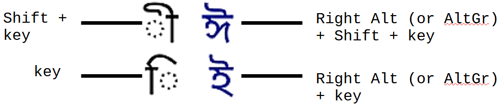

# Bangladesh National (jatiyo) Keyboard

A standardised keyboard layout created by the _Bangladesh Computer Council_ (BCC) on authority of the Government of the **People's Republic of Bangladesh**. As of 2022, this is the [standard layout issued by the Bangladesh Government](https://bcc.gov.bd/site/page/74683337-931a-4344-ab00-34cf2527acc6/Bangla-Language-Project).

 

> Installed directly on Windows Bangla (Bangladesh) language without any 3rd party software.

 

*Disclaimer: I am not affiliated with the BCC or the Government. Having searched for a 1st party (built-in) layout/keyboard for the [national layout](https://upload.wikimedia.org/wikipedia/commons/thumb/b/b9/KB-Bengali-Jatiyo.svg/1200px-KB-Bengali-Jatiyo.svg.png) on Windows and failing to find any, I decided to make one from scratch using [Microsoft Keyboard Layout Creator (MKLC) v1.4](https://www.microsoft.com/en-us/download/details.aspx?id=102134).*

 

### Important Points
- There is **no** 3rd party software involved. The `.msi` and `.exe` files are generated by MKLC.
- It is installed directly onto the official `Bangla (Bangladesh)` language on Windows so make sure to add said language from the `language` setting before installing the keyboard.
- It is only available for **Windows** (vista, 7, 8, 10, 11).
- It is **not** a phonetic keyboard.
- It is encouraged to verify the `setup.exe` file on [VirusTotal](https://www.virustotal.com/gui/home/upload) before proceeding to install, for peace of mind.

 

### How to install
- Go to the `language` setting on Windows, click on `add a language` and download/install the `Bangla (Bangladesh)` one.
- Download the `.zip` file from here.
- Extract it.
- Click on `setup.exe`.
- Restart the computer/laptop.
- Go to the `installed keyboards` section of the `Bangla (Bangladesh)` language setting and remove any variant of the keyboard **except** the `National (Jatiyo) Layout`.

 

### How to use
- The full picture layout can be found [here](https://upload.wikimedia.org/wikipedia/commons/thumb/b/b9/KB-Bengali-Jatiyo.svg/1200px-KB-Bengali-Jatiyo.svg.png).
- Use this [site](https://www.typingstudy.com/bn-bengali-3/lesson/1) for learning the layout and this [site](https://10fastfingers.com/typing-test/bengali) for practising.
- Use `⊞ Win` + `Space bar` for changing the input language.
- Use [this](https://github.com/WhiteHades/bangladesh-national-jatiyo-keyboard/blob/main/images/Bangla_Conjunction_Lists.pdf) conjunction sheet for reference on the difficult word/letter formations.

 

### Layout Key Instruction 
<kbd></kbd>

 

**জয় বাংলা, জয় বঙ্গবন্ধু**
